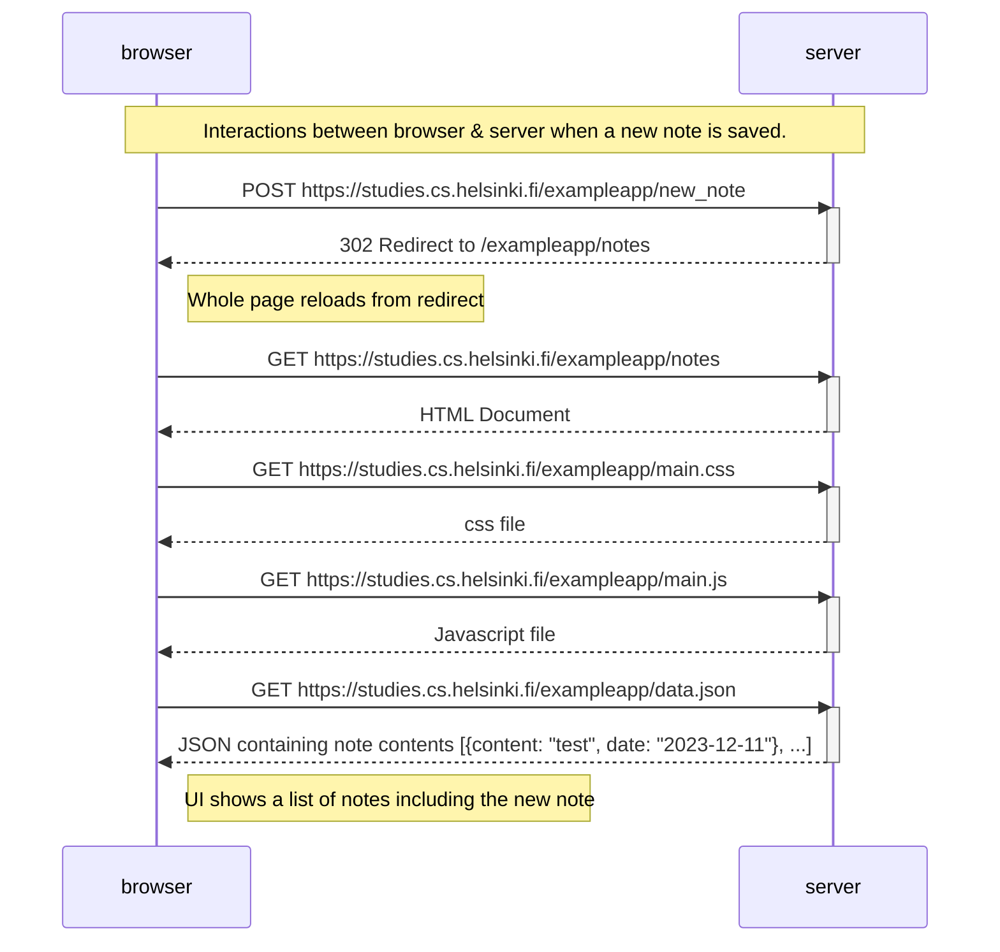

```mermaid
sequenceDiagram
    participant browser
    participant server

    Note over browser,server: Interactions between browser & server when a new note is saved.
    browser->>server: POST https://studies.cs.helsinki.fi/exampleapp/new_note
    activate server
    server-->>browser: 302 Redirect to /exampleapp/notes
    deactivate server
    Note right of browser: Whole page reloads from redirect
    
    browser->>server: GET https://studies.cs.helsinki.fi/exampleapp/notes
    activate server
    server-->>browser: HTML Document
    deactivate server

    browser->>server: GET https://studies.cs.helsinki.fi/exampleapp/main.css
    activate server
    server-->>browser: css file
    deactivate server

    browser->>server: GET https://studies.cs.helsinki.fi/exampleapp/main.js
    activate server
    server-->>browser: Javascript file
    deactivate server

    browser->>server: GET https://studies.cs.helsinki.fi/exampleapp/data.json
    activate server
    server-->>browser: JSON containing note contents [{content: "test", date: "2023-12-11"}, ...]
    deactivate server
    Note right of browser: UI shows a list of notes including the new note
```
