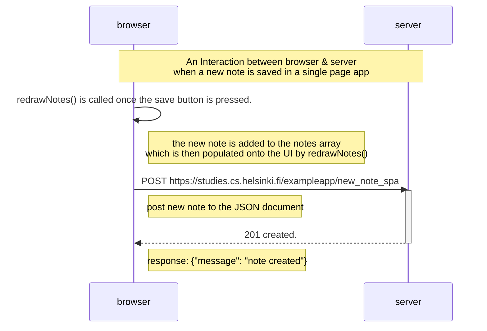

```mermaid
sequenceDiagram
    participant browser
    participant server

    Note over browser,server: An Interaction between browser & server<br>when a new note is saved in a single page app
    browser->>browser: redrawNotes() is called once the save button is pressed.
    Note right of browser: the new note is added to the notes array<br>which is then populated onto the UI by redrawNotes()

    browser->>server: POST https://studies.cs.helsinki.fi/exampleapp/new_note_spa
    activate server
    Note right of browser: post new note to the JSON document
    server-->>browser: 201 created.
    deactivate server
    Note right of browser: response: {"message": "note created"}
```
